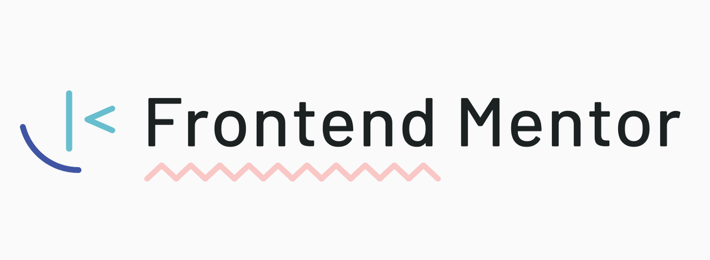

## Frontend Mentor Challenges

---

👩‍🚀<a href="https://www.frontendmentor.io/profile/arrizkyhp">arrizkyhp</a> | ✅ 9 Challenges

---

| Challenge                         | Base                   | Build in                   | 👨‍💻                                                                    | 🚀                                                                         |
| --------------------------------- | ---------------------- | -------------------------- | --------------------------------------------------------------------- | -------------------------------------------------------------------------- |
| **Order summary card**            | Html & CSS             | Scss, GulpJS, BEM          | [ Code](https://github.com/arrizkyhp/fm-order-summary-component)      | [ Live Site](https://arrizkyhp.github.io/fm-order-summary-component/)      |
| **Stats preview card**            | Html & CSS             | Scss, GulpJS, BEM          | [ Code](https://github.com/arrizkyhp/fm-stats-preview-card-component) | [ Live Site](https://arrizkyhp.github.io/fm-stats-preview-card-component/) |
| **3-column preview card**         | Html & CSS             | ReactJS, Scss, GulpJS, BEM | [ Code](https://github.com/arrizkyhp/three-column-preview-card)       | [ Live Site](https://arrizkyhp.github.io/three-column-preview-card/)       |
| **Profile card**                  | Html & CSS             | ReactJS, Scss, GulpJS, BEM | [ Code](https://github.com/arrizkyhp/profile-card-component-main)     | [ Live Site](https://arrizkyhp.github.io/profile-card-component-main/)     |
| **FAQ accordion card**            | Html & CSS             | ReactJS, Scss, GulpJS, BEM | [ Code](https://github.com/arrizkyhp/faq-accordion-card-main)         | [ Live Site](https://arrizkyhp.github.io/faq-accordion-card-main/)         |
| **Social proof section**          | Html & CSS             | ReactJS, Scss, GulpJS, BEM | [ Code](https://github.com/arrizkyhp/fm-social-proof-section)         | [ Live Site](https://arrizkyhp.github.io/fm-social-proof-section/)         |
| **Article preview component**     | Html, CSS & JavaScript | ReactJS, Scss, GulpJS, BEM | [ Code](https://github.com/arrizkyhp/fm-article-preview-component)    | [ Live Site](https://arrizkyhp.github.io/fm-article-preview-component/)    |
| **Four card feature section**     | Html, CSS              | ReactJS, Scss, GulpJS, BEM | [ Code](https://github.com/arrizkyhp/fm-four-card-feature)            | [ Live Site](https://arrizkyhp.github.io/fm-four-card-feature/)            |
| **Base Apparel coming soon page** | Html, CSS, JavaScript  | ReactJS, Scss, GulpJS, BEM | [ Code](https://github.com/arrizkyhp/fm-base-apparel-coming-soon)     | [ Live Site](https://arrizkyhp.github.io/fm-base-apparel-coming-soon/)     |
