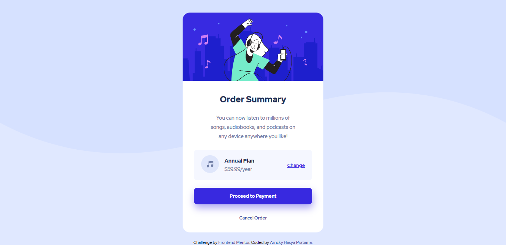
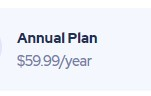

# Frontend Mentor - Order summary card solution

This is a solution to the [Order summary card challenge on Frontend Mentor](https://www.frontendmentor.io/challenges/order-summary-component-QlPmajDUj). Frontend Mentor challenges help you improve your coding skills by building realistic projects.

## Table of contents

- [Overview](#overview)
  - [The challenge](#the-challenge)
  - [Screenshot](#screenshot)
  - [Links](#links)
- [My process](#my-process)
  - [Built with](#built-with)
  - [What I learned](#what-i-learned)
  - [Continued development](#continued-development)
  - [Useful resources](#useful-resources)
- [Author](#author)
- [Acknowledgments](#acknowledgments)

## Overview

### The challenge

Users should be able to:

- See hover states for interactive elements

### Screenshot



### Links

- Solution: [Github](https://github.com/arrizkyhp/frontendmentor/tree/master/order-summary-component-main)
- Live Site URL: [Live Site](https://arrizkyhp.github.io/frontendmentor/order-summary-component-main/)

## My process

### Built with

- CSS custom properties
- Flexbox
- CSS Grid
- BEM naming
- [Sass](https://sass-lang.com/) - CSS extension
- [GulpJS](https://gulpjs.com/) - JS library

### What I learned

Since this is my first project using **Sass** and **GulpJS** i learned about Structuring Sass project, my css is neater, and its feels more fun to coding this way. I feel more excited to learn more deeply 😁

I think this also my first time combine SVG and color for background.

```css
body {
  background: $pale-blue url("../../images/pattern-background-desktop.svg");
  background-size: contain;
  background-repeat: no-repeat;
}
```

### Continued development

this area, it's look the same as design, but the way i coding it, it doesn't feel okay for me because i added a margin-bottom to seperate the two element, i try to do it with flex and grid but still not find the solution.



### Useful resources

- [Coder Coder](https://www.youtube.com/playlist?list=PLUWqFDiirlsu5az5EIyxe8ZddyNO_kDuP) - This is amazing playlist i learn BEM and How to use Sass and Gulp.
- [A Beginner’s Guide to Gulp JS (SCSS to CSS)](https://www.youtube.com/watch?v=5Qm1awYyVtI) - This also if you want to learn GulpJS.

## Author

- Github - [arrizkyhp](https://github.com/arrizkyhp)
- Frontend Mentor - [@arrizkyhp](https://www.frontendmentor.io/profile/arrizkyhp)
- Twitter - [@arrizkyhp](https://twitter.com/arrizkyhp)
